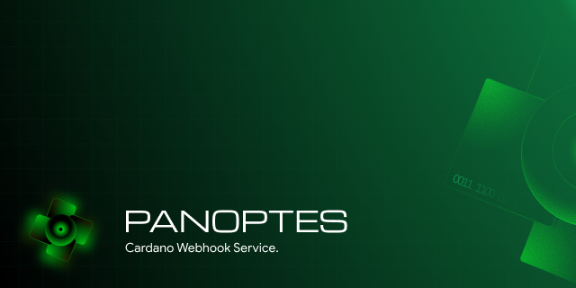

<div align="center">
  
  
  <h1>🔭 Panoptes</h1>
  <p><strong>Real-Time Cardano Blockchain Webhook Notifications</strong></p>
  
  [](https://github.com/txpipe/saib)
  [](https://github.com/txpipe/argus)
  [](https://dotnet.microsoft.com/)
  [](https://reactjs.org/)
  [](https://www.postgresql.org/)
  [](LICENSE)
  [](.github/CONTRIBUTING.md)
  
  <p>
    <strong>Panoptes</strong> is a production-ready webhook notification system for the Cardano blockchain. 
    Monitor addresses, track native assets, and receive real-time HTTP callbacks with enriched transaction data.
  </p>
</div>

---

## 🌟 Features

### Core Capabilities
- ✅ **Real-Time Blockchain Sync** - Powered by Argus.Sync and UtxoRPC (Demeter)
- 🎯 **Flexible Filtering** - Monitor specific addresses or policy IDs
- 🔔 **HTTP Webhooks** - Push notifications to any endpoint
- 🔄 **Automatic Retries** - Smart retry logic with exponential backoff
- 🚦 **Rate Limiting** - Per-subscription limits (60/min, 1000/hour configurable)
- 📊 **Rich Payload** - Enhanced transaction data with proper Bech32 addresses
- 💾 **Delivery Logs** - Full audit trail of webhook attempts

### Developer Experience
- 🎨 **Modern Dashboard** - React + Tailwind CSS control panel
- 🔐 **API Key Auth** - Secure your webhook endpoints
- 📝 **Comprehensive Metadata** - Self-documenting payloads with data quality flags
- 🐛 **Built-in Diagnostics** - Automatic detection of parsing issues
- 🔍 **Zero Data Loss Detection** - Alerts when outputs are filtered

---

## 🚀 Quick Start

### Prerequisites
- [.NET 9.0 SDK](https://dotnet.microsoft.com/download/dotnet/9.0) (9.0.308+)
- [Node.js 18+](https://nodejs.org/) (v24.11.0 recommended)
- [Docker](https://www.docker.com/) (for PostgreSQL)
- [Demeter.run API Key](https://demeter.run/) (UtxoRPC access)

### Verify Prerequisites

```bash
# Check .NET SDK version
dotnet --version
# Expected: 9.0.308 or higher

# Check Node.js and npm versions
node --version && npm --version
# Expected: v18+ (v24.11.0 recommended) and npm 8+ (11.6.1 recommended)

# Check Docker
docker --version
# Expected: Docker 20+ with Compose support
```

### Installation

```bash
# Clone the repository
git clone https://github.com/gauciv/panoptes.git
cd panoptes

# Start PostgreSQL database (required)
docker compose up -d

# Verify database is running
docker ps
# Expected: panoptes_db container running on port 5432

# Build the backend
dotnet build

# Install frontend dependencies
cd Panoptes.Client
npm install
```

### Configuration

**GUI-Based Setup (Recommended)**

Panoptes features a built-in setup wizard for easy configuration:

1. Start the backend: `dotnet run --project Panoptes.Api`
2. Start the frontend: `cd Panoptes.Client && npm run dev`
3. Open http://localhost:5173 in your browser
4. Complete the Setup Wizard with your Demeter credentials

The wizard will:
- ✅ Validate your API key by connecting to Demeter
- 🔒 Encrypt credentials using ASP.NET Core Data Protection
- 💾 Store configuration securely in PostgreSQL database
- 🚀 Auto-start the blockchain sync worker

**Manual Configuration (Advanced)**

For automated deployments, you can also configure via `appsettings.Local.json`:

```json
{
  "ConnectionStrings": {
    "DefaultConnection": "Host=localhost;Port=5432;Database=panoptes_db;Username=postgres;Password=panoptes_password"
  },
  "Argus": {
    "GrpcEndpoint": "https://cardano-preprod.utxorpc-m1.demeter.run",
    "ApiKey": "YOUR_DEMETER_API_KEY_HERE",
    "Network": "Preprod"
  }
}
```

> ⚠️ **Security Note**: GUI configuration is preferred as credentials are encrypted at rest. If using config files, never commit `appsettings.Local.json` to version control!

### Running the Application

**Backend (Terminal 1):**
```bash
dotnet run --project Panoptes.Api
# API runs on http://localhost:5033
```

**Frontend (Terminal 2):**
```bash
cd Panoptes.Client
npm run dev
# Dashboard runs on http://localhost:5173
```

**First Run:**
- Open http://localhost:5173
- Complete the Setup Wizard with your [Demeter.run](https://demeter.run) API key
- ArgusWorker will start automatically once configured

---

## 📖 Usage

### Creating a Subscription

1. Open the dashboard at `http://localhost:5173`
2. Click **"New Subscription"**
3. Configure:
   - **Name**: Descriptive label
   - **Target URL**: Your webhook endpoint (e.g., `https://webhook.site/unique-id`)
   - **Event Type**: `transaction`, `block`, or `rollback`
   - **Filters** (optional):
     - Target Address: Monitor specific Cardano address
     - Policy ID: Track native assets by policy

### Webhook Payload Structure

```json
{
  "Event": "transaction",
  "TxHash": "3eb8f9...",
  
  "Metadata": {
    "MatchReason": "Address: addr_test1...",
    "InputCount": 2,
    "OutputCount": 3,
    "OutputsIncluded": 3,
    "InputAmountsHydrated": false,
    "TotalOutputAda": 10.5,
    "DataLossWarning": null
  },
  
  "TotalReceived": {
    "addr_test1wzn...": "8.00 ADA",
    "addr_test1vry...": "2.00 ADA"
  },
  
  "Fees": {
    "Lovelace": 170000,
    "Ada": 0.17
  },
  
  "Inputs": [
    {
      "TxHash": "5a3c2d...",
      "OutputIndex": 1
    }
  ],
  
  "Outputs": [
    {
      "Address": "addr_test1wzn...",
      "AddressHex": "01abc...",
      "Amount": {
        "Lovelace": 3000000,
        "Ada": 3.0
      },
      "Assets": [
        {
          "PolicyId": "362e...",
          "NameHex": "546f6b656e",
          "NameUTF8": "Token",
          "Quantity": 100
        }
      ],
      "IsChange": null
    }
  ],
  
  "Block": {
    "Slot": 109341540,
    "Hash": "42fba...",
    "Height": 2850123
  },
  
  "Timestamp": "2025-12-06T10:30:00.000Z"
}
```

### Key Payload Features

#### 🎯 Honest Data Quality Flags
- **`InputAmountsHydrated: false`** - Inputs don't include amounts (requires querying previous transactions)
- **`IsChange: null`** - Without input hydration, we can't determine if an output is change or payment
- **`DataLossWarning`** - Alerts when outputs are filtered due to parsing errors

#### 💰 TotalReceived vs Balance
- **`TotalReceived`**: Shows ADA received per address in this transaction (OUTPUT ONLY)
- **NOT** a net balance calculation (would require input amounts)
- For self-transfers, this doesn't mean the address "gained" money

#### 🏷️ Asset Names
- **`NameHex`**: Source of truth (always present)
- **`NameUTF8`**: Human-readable (only if valid UTF-8)
- Handles binary/special character asset names safely

---

## 🏗️ Architecture




### Project Structure

```
panoptes/
├── Panoptes.Api/              # ASP.NET Core Web API
│   ├── Controllers/           # REST API endpoints
│   │   ├── HealthController.cs        # System health & metrics
│   │   ├── SetupController.cs         # Demeter configuration
│   │   └── SubscriptionsController.cs # Webhook CRUD operations
│   ├── Workers/               # Background services
│   │   ├── ArgusWorker.cs             # Blockchain sync worker
│   │   └── WebhookRetryWorker.cs      # Failed delivery retry
│   ├── DTOs/                  # Data transfer objects
│   ├── Auth/                  # API authentication
│   └── Program.cs             # Application entry point
│
├── Panoptes.Core/             # Domain layer (entities, interfaces)
│   ├── Entities/              # Database models
│   │   ├── WebhookSubscription.cs
│   │   ├── DeliveryLog.cs
│   │   ├── DemeterConfig.cs
│   │   └── SystemState.cs
│   ├── Interfaces/            # Contracts
│   └── External/              # External type definitions
│
├── Panoptes.Infrastructure/   # Data access & services
│   ├── Persistence/           # EF Core DbContext
│   ├── Services/              # Business logic
│   │   ├── PanoptesReducer.cs         # Transaction processor
│   │   └── WebhookDispatcher.cs       # HTTP delivery
│   ├── Providers/             # External service integrations
│   ├── Configurations/        # App configuration models
│   └── Migrations/            # EF Core migrations
│
├── Panoptes.Client/           # React frontend
│   ├── src/
│   │   ├── pages/             # Route components
│   │   │   ├── Dashboard.tsx
│   │   │   ├── Landing.tsx
│   │   │   ├── Analytics.tsx
│   │   │   ├── Health.tsx
│   │   │   ├── Settings.tsx
│   │   │   └── SubscriptionDetail.tsx
│   │   ├── components/        # Reusable UI components (40+)
│   │   ├── services/          # API client (axios)
│   │   ├── context/           # React context (Auth)
│   │   ├── hooks/             # Custom hooks
│   │   ├── layouts/           # Page layouts
│   │   └── types/             # TypeScript definitions
│   ├── vite.config.ts         # Vite configuration
│   └── package.json
│
├── Panoptes.Tests/            # Unit tests
├── terraform/                 # AWS infrastructure as code
├── docker-compose.yml         # PostgreSQL container
└── docker-compose.prod.yml    # Production deployment
```

### Components

| Component | Description | Technology |
|-----------|-------------|------------|
| **ArgusWorker** | Blockchain sync service using Argus.Sync | .NET Background Service |
| **PanoptesReducer** | Transaction processing, address matching, rate limiting | Argus IReducer |
| **WebhookDispatcher** | HTTP delivery with HMAC signing | HttpClient |
| **WebhookRetryWorker** | Background retry for failed deliveries | .NET Background Service |
| **AppDbContext** | Entity Framework persistence | Npgsql + PostgreSQL |
| **Dashboard** | React-based management UI | React 18 + Tailwind CSS |

---

## 🔧 Configuration

### Rate Limiting
Configure per-subscription limits:
```json
{
  "MaxWebhooksPerMinute": 60,
  "MaxWebhooksPerHour": 1000,
  "EnableBatching": false,
  "BatchWindowSeconds": 10
}
```

### Retry Policy
Automatic retries with exponential backoff:
- **Max Attempts**: 5
- **Backoff**: 30s, 1m, 5m, 15m, 1h
- **Status Tracking**: `Pending`, `Success`, `Failed`, `Retrying`

---

## 🐛 Debugging

### Suspicious Zero-Value Outputs

If you see `DataLossWarning` in metadata:

```json
{
  "Metadata": {
    "OutputCount": 3,
    "OutputsIncluded": 2,
    "DataLossWarning": "⚠️ CRITICAL: Outputs were filtered..."
  }
}
```

**Check the API logs for:**
```
⚠️ SUSPICIOUS ZERO VALUE DETECTED - Parsing may have failed!
  Address: 01abc...
  Raw Amount Type: Chrysalis.Cbor.Types.Cardano.Core.Common.Value
  Amount object dump: {...}
```

This indicates a parsing issue with the CBOR structure. Report these logs for investigation.

---

## 🔐 Security Best Practices

### API Key Management
✅ **DO:**
- Use the built-in Setup Wizard (credentials are encrypted at rest)
- Update credentials via Settings page (automatic re-encryption)
- Use environment variables for automated deployments
- Rotate keys regularly through the Settings interface

❌ **DON'T:**
- Commit `appsettings.Local.json` if it contains API keys
- Share database files (`panoptes.db`) between environments
- Use development keys in production

### Webhook Security
- Use HTTPS endpoints only
- Validate webhook signatures (implement HMAC)
- Implement request authentication on your endpoint

---

## �️ Tech Stack (Verified Versions)

| Category | Technology | Version |
|----------|------------|---------|
| **Backend Runtime** | .NET | 9.0.308 |
| **Backend Framework** | ASP.NET Core | 9.0 |
| **Blockchain Sync** | Argus.Sync | 0.3.17-alpha |
| **CBOR Parsing** | Chrysalis.Cbor | Latest |
| **ORM** | Entity Framework Core | 9.0.0 |
| **Database** | PostgreSQL | 17 (Alpine) |
| **Frontend Runtime** | Node.js | 24.11.0 |
| **Package Manager** | npm | 11.6.1 |
| **Frontend Framework** | React | 18.2.0 |
| **Build Tool** | Vite | 7.2.6 |
| **Language** | TypeScript | 5.2.2 |
| **Styling** | Tailwind CSS | 3.4.1 |
| **Animation** | Framer Motion | 11.0.0 |
| **Charts** | Recharts | 2.15.4 |
| **HTTP Client** | Axios | 1.6.7 |
| **Routing** | React Router DOM | 7.10.1 |
| **Authentication** | AWS Amplify | 6.15.9 |

---

## �📊 Performance

- **Sync Speed**: ~1000 blocks/minute (Preprod)
- **Webhook Latency**: <100ms (processing) + network time
- **Database**: PostgreSQL 17 (production-ready)
- **Scalability**: Horizontal scaling via Docker/Kubernetes

---

## 🤝 Contributing

We welcome contributions from the community! Whether you're fixing bugs, adding features, or improving documentation, your help makes Panoptes better for everyone.

### How to Contribute

1. **Read the Guidelines**: Check out our [Contributing Guide](.github/CONTRIBUTING.md)
2. **Find an Issue**: Look for issues tagged with `good first issue` or `help wanted`
3. **Fork & Code**: Make your changes following our coding standards
4. **Submit PR**: Use our [Pull Request Template](.github/PULL_REQUEST_TEMPLATE.md)

### Ways to Contribute

- 🐛 **Report Bugs**: Use our [Bug Report Template](.github/ISSUE_TEMPLATE/bug_report.md)
- ✨ **Request Features**: Use our [Feature Request Template](.github/ISSUE_TEMPLATE/feature_request.md)
- 📝 **Improve Docs**: Fix typos, add examples, write tutorials
- 🧪 **Write Tests**: Improve test coverage
- 🔍 **Review PRs**: Help review pull requests from other contributors

### Built With

- [Argus.Sync](https://github.com/txpipe/argus) - Blockchain indexing framework by TxPipe
- [Chrysalis.Cbor](https://www.nuget.org/packages/Chrysalis.Cbor) - CBOR deserialization for Cardano
- [UtxoRPC](https://utxorpc.org/) - Cardano data provider (via Demeter)

### Code of Conduct

This project follows the [Contributor Covenant Code of Conduct](.github/CODE_OF_CONDUCT.md). By participating, you are expected to uphold this code.

---

## 📝 License

MIT License - see [LICENSE](LICENSE) for details

---

## 🙏 Acknowledgments

- **TxPipe** - For Argus.Sync and SAIB competition
- **Demeter.run** - For UtxoRPC infrastructure
- **Cardano Foundation** - For the amazing blockchain

---

<div align="center">
  
  <p><strong>Panoptes - All-Seeing Blockchain Monitoring</strong></p>
  <p>Made with ❤️ for the Cardano Community</p>
</div>